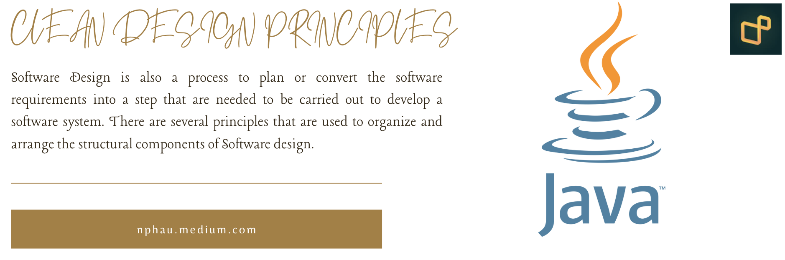
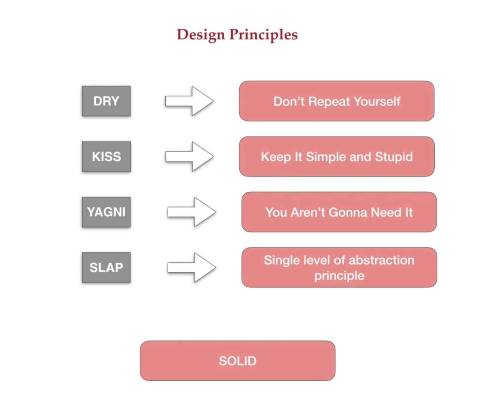
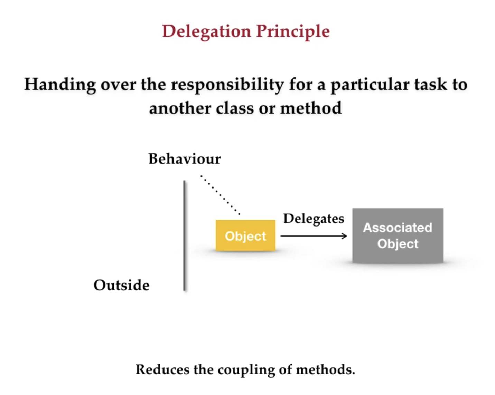
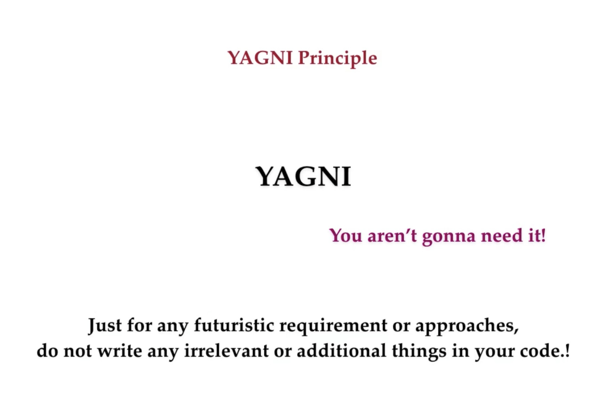
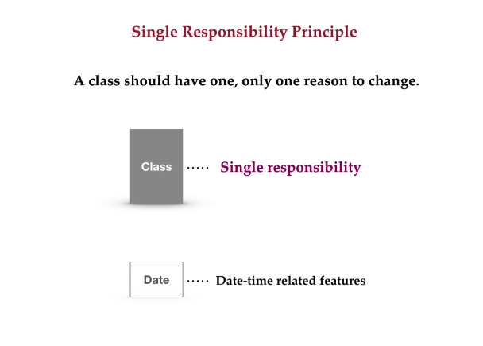
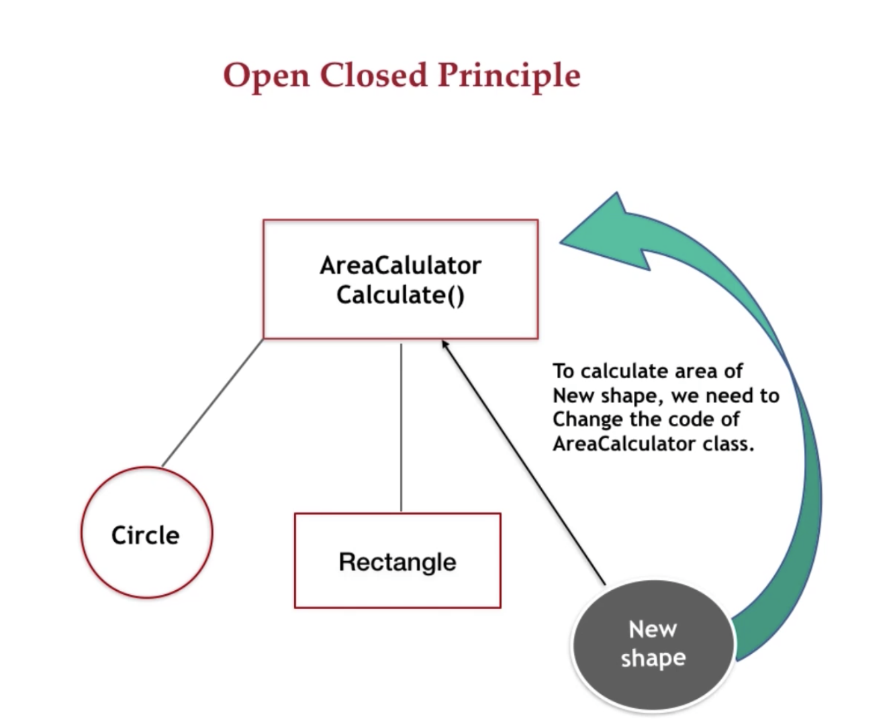
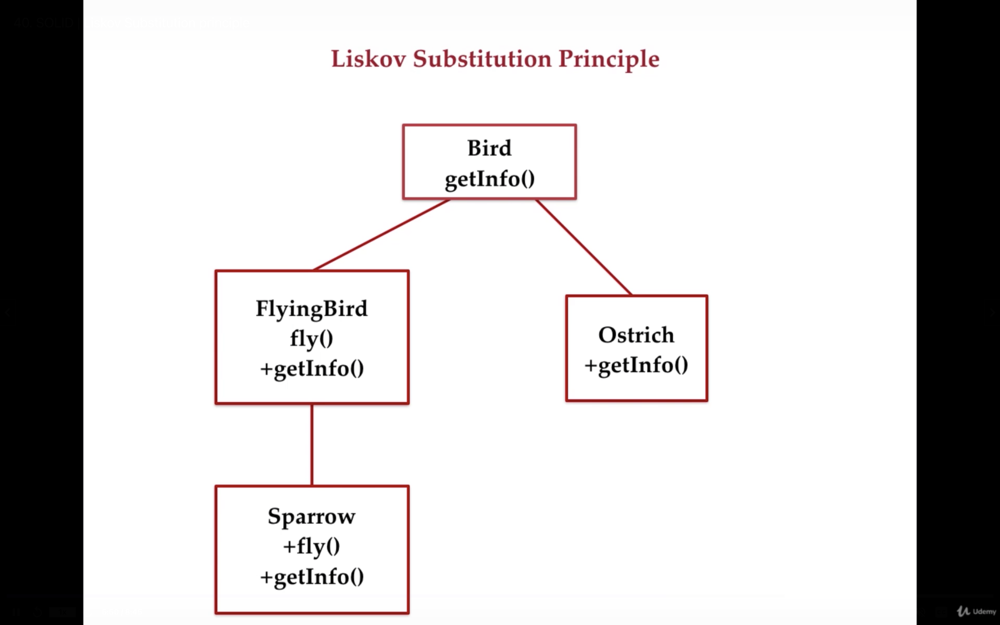
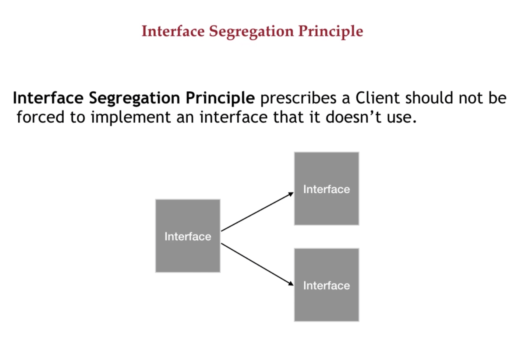
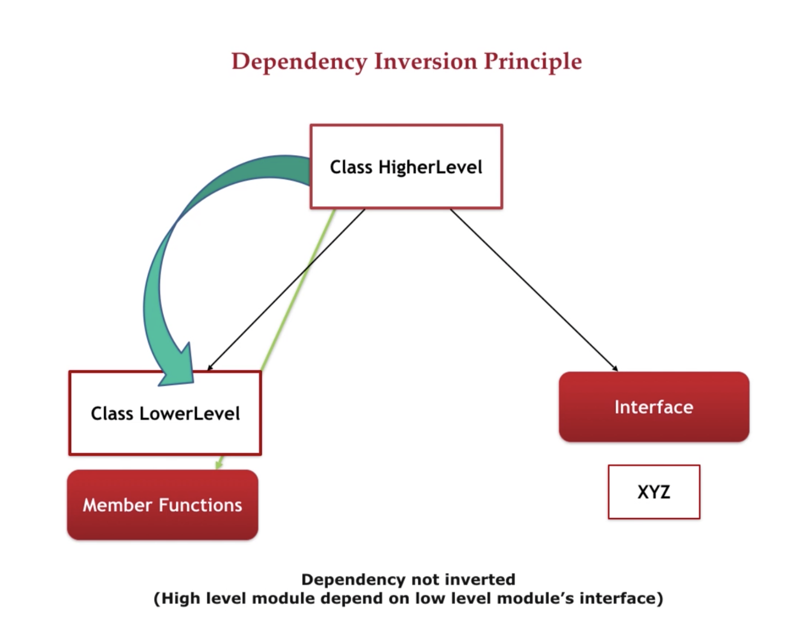

<h1 align="center"> Clean Design Principles </h1>

<p align="center">
  <a href="https://github.com/facebook/react-native/blob/HEAD/LICENSE">
    
  </a>
  <a href="https://reactnative.dev/docs/contributing">
    
  </a>
</p>

<div align="center"></div>


## 💀 Overview

<div align="center"></div>

## 👇 Principles

| #                                   | Principle                                                                           | Java                                                                           
|-------------------------------------|-------------------------------------------------------------------------------------|--------------------------------------------------------------------------------
| 01: Delegation                      | <div align="center"></div> | [Solution](src/sg/nphau/clean/principles/delegation/DelegationExample.java) |
| 02: Slap                            | <div align="center"></div>     | [Solution](src/sg/nphau/clean/principles/slap/Slap.java)                       |
| 03: Yagni                           | <div align="center"></div>    | [Solution](src/sg/nphau/clean/principles/yagni/Yagni.java)                     |
| 04: Single Responsibility Principle | <div align="center"></div>      | [Solution](src/sg/nphau/clean/principles/solid/srp/SRPExample.java) |
| 05: Open-Closed Principle           | <div align="center"></div>      | [Solution](src/sg/nphau/clean/principles/solid/ocp/OCPExample.java)        |
| 06: Liskov Substitution principle   | <div align="center"></div>      | [Solution](src/sg/nphau/clean/principles/solid/lsp/LSPExample.java) |
| 07: Interface segregation principle | <div align="center"></div>    | [Solution](src/sg/nphau/clean/principles/solid/lsp/ISPExample.java) |
| 08: Dependency Inversion principle  | <div align="center"></div>    | [Solution](src/sg/nphau/clean/principles/solid/lsp/DIPExample.java) |

## 🚀 SOLID
https://en.wikipedia.org/wiki/SOLID

`S — Single Responsibility principle` : There should never be more than one reason for a class to change. In other words, every class should have only one responsibility.

`O — Open-Closed principle` : Software entities ... should be open for extension, but closed for modification

`L — Liskov Substitution principle`: Functions that use pointers or references to base classes must be able to use objects of derived classes without knowing it

`I — Interface Segregation principle`: Clients should not be forced to depend upon interfaces that they do not use.

`D — Dependency Inversion principle`: Depend upon abstractions, not concretions.


## 🚀 Folder Structure

The workspace contains two folders by default, where:

- `src`: the folder to maintain sources
- `lib`: the folder to maintain dependencies

Meanwhile, the compiled output files will be generated in the `bin` folder by default.

> If you want to customize the folder structure, open `.vscode/settings.json` and update the related settings there.

## ✨ Contributing

Please feel free to contact me or make a pull request.

## ⚙️ Copyright

```
Created by $username on $today
Copyright (c) $today.year . All rights reserved.
Last modified $file.lastModified
```


## 👇 Authors

<p>
    <a href="https://nphausg.medium.com/" target="_blank">
    
    </a>
</p>
